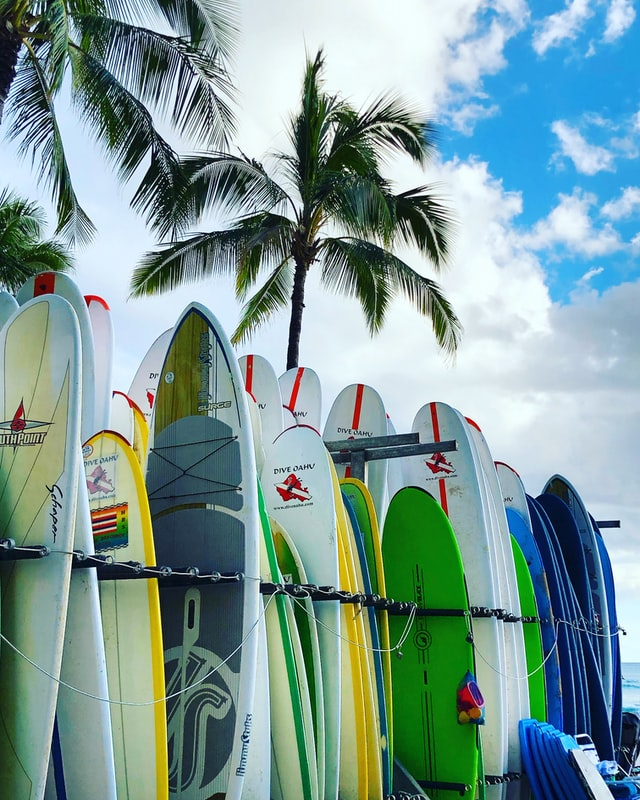
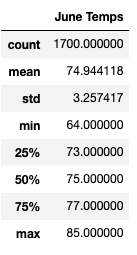
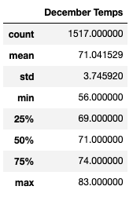

# Surfs Up
We decided to combine two passions to create a business targeting ice cream and surfing.  We have a solid business plan to open a Surf n' Ice Cream shop in Oahu, HI.  Even though we have the initial investment saved up we are looking for investors to back-up our idea.  One potential investor is interested but wants more information on weather in the area.  

## Analysis:
The purpose of this write up is to give more temperature clarity around the months of June and December in Oahu,HI.  The goal is to determine if the proposed Surf n' Ice Cream Shop could sustain a year-round business.  

### Results:
Weather data was pulled for the months of June and December for all years in the database that was provided to us. We filter the data to June and December and ran statistics to compare the two months.  Please see the summary statistics for the months of June and December below.  This data spans about 7 years so the data is robust enough to get a general idea of the weather. 

There are a few things we can conclude looking at the statistical summaries:
* June has 183 more data points than December.  There could be a few reasons like missing values but one reason I saw was the December 2017 is missing.  The data set stopped at 2017-08-23.
* There is very little variation between June and December temperatures.  This is confirmed by the mean temperatures (Average), max temperatures and similar standard deviations (~3 degs).  
* We do see at times December can drop in temperature (min temp of 56 degs) however the average is ~71 and 25 percentile temp is 69 degs, therefore, it is probably not often. 

## Summary:

The good news from our queries is that most likely the temperature is favorable year around for ice cream and surfing.   

In order to get a more complete picture of weather, here are two additional queries to perform for June and December: 
1. Find out how often it rains.
2. Possible explore other weather sites close to the shops location to collect data from.

